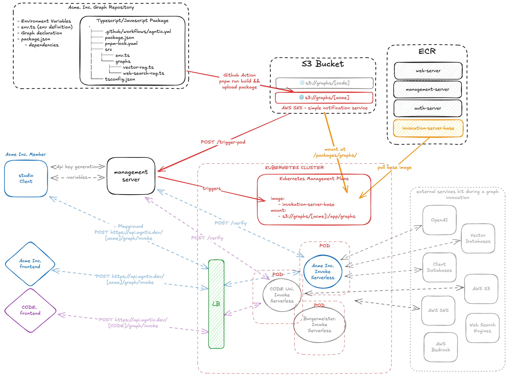

# Agent Studio

A full-stack application designed for building, managing, and interacting with LangGraph AI agents. Built using a modern tech stack within a Turborepo monorepo.

## Vision

**Warning:** The following diagram is a high-level overview of the vision for the project. It does not represent the current state of the project.

This project aims to provide a comprehensive studio environment for developing, testing, and deploying sophisticated LangGraph AI agents.

This is highly inspired by the LangGraph Platform, a closed-source product, however we are building a fully open-source and self-hostable version of it to empower the community to adopt graph-based AI agents without the uncertainty of vendor lock-in.



In this diagram, you can see the high-level overview of the agentic flow in Agent Studio.

The platform once deployed, will allow users to:

- Create AI Agents using LangGraph-js in standalone repositories.
- Deploy AI Agents to the platform using a github action.
- Interact with AI Agents using a web interface (playground).
- Manage organizations and workspaces to group AI Agents.

## Features

- **Monorepo:** Managed with Turborepo and pnpm for efficient builds and dependency management.
- **Frontend:** Built with Next.js (using Turbopack), React 19, TypeScript, Tailwind CSS, and Shadcn UI components.
- **Backend:** Powered by Hono, a fast and lightweight web framework, using TypeScript.
- **API:** Type-safe API layer using tRPC connecting frontend and backend.
- **Database:** ORM layer with Drizzle, likely targeting PostgreSQL.
- **AI Integration:** Leverages LangChain and LangGraph for building complex AI agent workflows, supporting models like OpenAI and Anthropic.
- **Vector Storage:** Utilizes ChromaDB for efficient vector similarity searches.
- **File Storage:** Integration with AWS S3 for file handling.
- **Environment Management:** Secure environment variable handling with T3 Env.

## Tech Stack

- **Monorepo:** Turborepo, pnpm
- **Frontend:** Next.js 15, React 19, TypeScript, Tailwind CSS, Shadcn UI, TanStack Query/Table/Form, tRPC Client
- **Backend:** Hono, TypeScript, Node.js
- **API:** tRPC
- **Database:** Drizzle ORM, PostgreSQL (likely)
- **AI:** LangChain, LangGraph, OpenAI, Anthropic
- **Vector DB:** ChromaDB
- **File Storage:** AWS S3
- **Linting/Formatting:** ESLint, Prettier
- **Development Runner:** tsx

## Prerequisites

- Node.js (>= v20 recommended)
- pnpm (v10.7.1 or compatible)
- Git
- Docker (optional, for `docker-compose.dev.yml`)
- PostgreSQL Database Access
- Required API Keys (see `.env.example`)

## Getting Started

1.  **Initial Setup:**

    ```bash
    pnpm install
    cp .env.example .env
    # Edit .env with your database connection details and API keys

    ./dev-setup.sh
    ```

2.  **Database Migration:**

    ```bash
    pnpm db:push
    ```

3.  **Run Development Servers:**
    ```bash
    pnpm dev
    ```
    - Web: `http://localhost:3000`
    - Server: `http://localhost:3030`

## Available Scripts

Here are some useful scripts available from the root directory:

- `pnpm dev`: Starts the development servers for all apps (`web`, `server`).
- `pnpm build`: Builds all apps for production.
- `pnpm dev:web`: Starts the development server only for the `web` app.
- `pnpm dev:server`: Starts the development server only for the `server` app.
- `pnpm db:push`: Applies database schema changes using Drizzle Kit (targets the `server` app).
- `pnpm db:studio`: Opens Drizzle Studio to interact with your database (targets the `server` app).
- `pnpm lint`: Lints the codebase across all apps.
- `pnpm check-types`: Performs type checking across all apps.
- `pnpm format`: Formats the codebase using Prettier.
- `pnpm clean`: Removes build artifacts and `node_modules` directories.

## Cybersecurity measures

### Current measures

- **Authentication & Authorization:** Utilizes `better-auth` for handling email/password, Google OAuth. Session-based authorization is enforced via tRPC protected procedures and Hono middleware, ensuring only authenticated users can access protected resources.
- **Input Validation:** Employs `zod` schemas for validating inputs in backend services (e.g., document search, deletion parameters). Basic validation is performed on file uploads (size, name, type). Environment variables are validated at runtime using `@t3-oss/env-*`.
- **Secrets Management:** Relies on environment variables (`.env`) for sensitive data like API keys and database credentials, preventing hardcoding in source code. T3 Env ensures required variables are present and correctly formatted.
- **API Security:** Leverages tRPC for type-safe communication between frontend and backend. CORS policies are configured using `hono/cors` to restrict cross-origin requests.
- **Database Security:** Uses Drizzle ORM, which helps mitigate SQL injection risks through parameterized queries.
- **Dependency Management:** Uses `pnpm` with a lockfile (`pnpm-lock.yaml`) for deterministic dependency installation. Dependency updates and vulnerability are managed via Dependabot.
- **Enumeration Prevention:** Uses non-sequential IDs (e.g., UUIDs) for key resources where applicable, making it harder for attackers to guess identifiers.

### Future plans

- Implement API key authentication for inference (currently only schema is present)
- Implement rate limiting for API endpoints (especially API key usage and resource-intensive operations).
- Enhance input sanitization specifically for LLM prompts to mitigate prompt injection risks.
- **Session Security:** Employs HttpOnly, Secure cookies for session management, typically using short-lived access tokens and longer-lived refresh tokens to minimize exposure.
- Conduct regular dependency vulnerability scanning and updates (formalize process if not already done).
- Implement more comprehensive file validation beyond basic checks (e.g., magic number checks, stricter size limits, potentially virus scanning).
- Add security headers (e.g., CSP, HSTS, Permissions-Policy) via Hono middleware.
- Implement checks against known breached password lists during signup/password change. (via `better-auth`'s haveibeenpwned integration)
- Introduce multi-factor authentication (TOTP via `better-auth`).
- Implement user-facing session management (view active sessions, revoke specific sessions).
- Send email notifications for security-sensitive events (e.g., logins from new devices, password changes).

## Threat Model

- **Injection Attacks:**
  - _Prompt Injection (Medium-High):_ Direct interaction with LLMs via LangChain/LangGraph makes this a significant risk. Requires robust input sanitization (only an issue for LLM prompts if we want to block certain inputs).
  - _Cross-Site Scripting (XSS) (Low):_ React/Next.js offer protection, and the generated markdown is rendered via a react library that sanitizes the markdown.
  - _SQL Injection (Low):_ Mitigated by the use of Drizzle ORM, assuming standard usage patterns.
- **Authentication/Authorization Issues (Medium):** Potential risks include weak user passwords, compromised OAuth/API keys, session hijacking/fixation, or flaws in the `better-auth` configuration/implementation allowing unauthorized access.
- **Insecure File Handling (Medium):** Uploading and processing various file types (PDF, DOCX, TXT) introduces risks. Malicious files could target parsers (`pdf-parse`, `mammoth`), cause DoS, or potentially contain malware. Requires robust validation of file types, sizes, and potentially content scanning.
- **Data Exposure (High):** Misconfiguration of S3 permissions, database access, insufficiently protected API endpoints, or insecure logging could lead to data leaks. Depends on careful implementation of authorization checks and data handling.
- **Denial of Service (DoS) (Medium):** Resource-intensive tasks like file processing, embedding generation, or complex LangGraph agent runs could be exploited without proper controls like rate limiting, resource constraints, or CDN protection. (We could fix this by preventing graphs of certain size, and/or stoping the graph execution if it takes too long)
- **Dependency Vulnerabilities (Medium):** Use of third-party libraries introduces the risk of inheriting their vulnerabilities. Requires ongoing monitoring and updates. (We currently have quite a long list of dependencies, wich increases the risk of vulnerabilities)
- **Misconfiguration (Low-Medium):** Incorrect CORS settings, insecure default environment variables, overly permissive security headers, or improper security library setup could weaken the posture.
- **Cross-Site Request Forgery (CSRF) (Low-Medium):** Potential risk if state-changing actions rely solely on session cookies without specific anti-CSRF mitigation like tokens or SameSite cookie attributes.
- **Information Disclosure (Low-Medium):** Potential risks from timing attacks on certain endpoints, verbose error messages in production, or analysis of client-side JavaScript bundles revealing internal logic or dependencies.
- **Man-in-the-Middle (MITM) (Low):** Possible if HTTPS is not strictly enforced (e.g., during redirects or with mixed content) or through compromised client environments/networks. Mitigated primarily by strict HTTPS enforcement (HSTS).
- **Process Risks / Human Error (Low-Medium):** Accidental exposure of secrets, deployment of buggy/vulnerable code without review, or insecure development practices. Mitigated by strong development processes (e.g., code reviews, automated testing, secrets management tools).

## License

This project is licensed under the MIT License. See the [LICENCE](./LICENCE) file for details.
